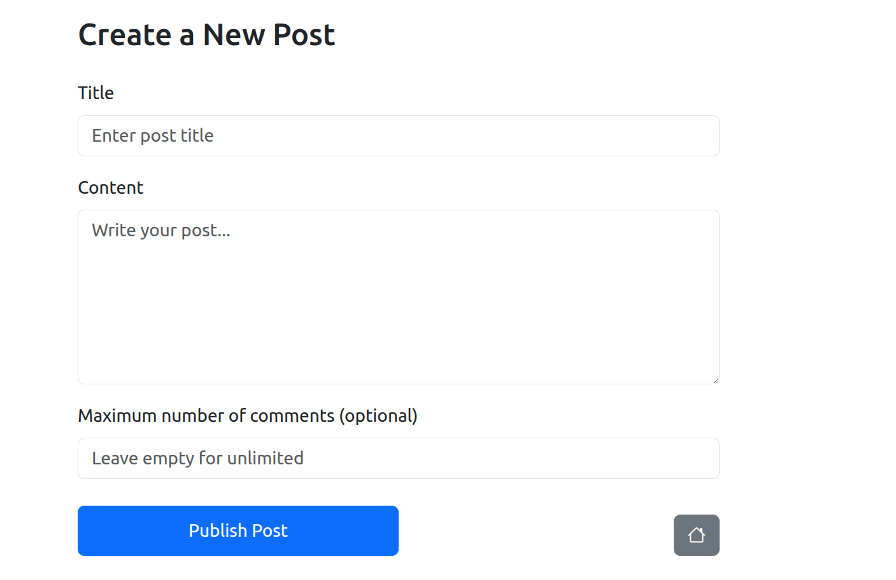

# Exam #1234: "Forum"
## Student: s349453 COZZATELLI GIORGIO 

## React Client Application Routes

### Authn routes
- Route `/login`: simple login form where the visitor has to give email and password for authentication
- Route `/loginTOTP`: in this page the QR code for TOPT (second factor authn) is provided and the already authenticated user who ha admin privileges has to provide it.

### Free Routes
- Route `/`: returns the homepage of the Forum, freely accessible by every visitor

### Protected Routes (accessible by authenticated users)
- Route `/posts/:id`: it shows a single post (the one with the id in the url), with its comments
- Route `/addPost`: it redirects to a Form for a new Post creation
- Route `/editPost/:id`: it redirects to a Form where an already existing post (the one with the id specified in the url) can be modified within its text

### MAIN REACT COMPONENTS (X component is stored in "x.jsx" file)
- `Wrapper` : this is just a wrapper for all the routes, App.jsx is focused on authentication and context
- `Home` : this is basically another wrapper that contains all the PostCards, visible to all visitors
- `NavigationBar` : this is used basically to perform login/logout (icon of the person for login and arrow for logout), admin authentication in case the user is an admin (if it is a button with a lock icon will appear and it will redirect to the route `/loginTOTP`), or if it's an authenticated user adding a new post (button plus).
- `PostCard` : this is the fundamental element of the homepage, each PostCard has a sort of preview of a post. It will show: title, text, number of comments and max comment, plus the possibility to append a comment right away for visitors (anonymous comments) by clicking the plus icon next to the number of comments. 
- `PostDisplay` : The post displayer shows the post with all its attributes, here only authenticated users can access and vote comments. The comments are shown with a secondary element called ShowComments
- `PostAdder` : It's a simple Form for the addition of a new post
- `PostEditor` : It's similar to Post adder except only the text of the post can be modified
- `AdminLogin` : Accessible with the route `/loginTOTP` in case it's a user admin, it provides the possibility to perform second factor authn
- `CommentVoting` : It is just a little component for the comments' votation appendend to all the comments in PostDisplay

## API Server

- POST `/login`
  - No parameters, username and password requested in the body (username is the email)
  - Response: user info (email, name, id) (no sensible information)
- POST `/login-totp`
  - No parameters, otp requested in the body
  - Response: {otp : "authorized"}
- POST `/post`
  - No parameters, user must be authn, Body fields: (title, text, maxcomments (optional))
  - Response: id of the post created
- POST `/comment/:id`
  - Parameter: post id, user must be authn, Body fields: (text)
  - Response: all comment information
- GET `/2faCode`
  - No parameters, the user must be authn
  - Response: url of a QR code
- GET `/session`
  - No parameters, the user must be authn
  - Response: user info (no sensible info)
- GET `/post`
  - No parameters, the user must be authn
  - Response: array of every post in the database
- GET `/post/:id`
  - Parameter: post id, the user must be authn
  - Response: Information of the post with the specified id in the database (if any)
- GET `/comment/:id`
  - Parameter: associated post id, the user must be authn
  - Response: array of the comments under the specified post
- GET `/comment/:id/allMark`
  - Parameter : comment id, the user must be authn
  - Response : it returns an array of all the likes given to the specified comment (comment_id, user_id, timestamp)
- PUT `/post/:id`
  - Parameter: post id, the user must be authn, Body fields: text
  - Response : a simple message notifying success
- PUT `/comment/:id/mark`
  - Parameter: comment id, user must be authn
  - Response: just a success message
- PUT `/comment/:id/unmark`
  - Parameter : comment id, user must be authn
  - Response : just a success message
- PUT `/comment/:id`
  - Parameter : comment id, user must be authn, Body fields: text;
  - Response : comment informations
- DELETE `/logout`
  - No parameters, user must be authn
  - No response
- DELETE `/post/:id`
  - Parameter: post id, user must be authn, the author or the admin
  - Response : success message
- DELETE `/comment/:id`
  - Parameter: comment id, user must be authn, the author or the admin
  - Response : success message

## Database Tables

- Table `users` - contains id email name hash salt secret (in case of admin)
- Table `posts` - contains id title author authorid text currentcomments maxcomments timestamp
- Table `comments` - contains id text timestamp author author_id post 
- Table `interesting` - contains id user_id comment_id timestamp (user_id and comment_id foreign keys)

## Screenshot

## Users Credentials

- matteo.salvini@mit.gov.it, VivaIlDuca!
- christian.desica@libero.it, No41V4cc1n1!
- rene.ferretti@cinema.it, C4gn4_M4l3d3tt4
- stanis.larochelle@gmail.com, S74Zinnon4
- tony.stark@starkindustries.com, I4mIron_m4n
- jean.valjean@hotmail.com, L3s_m1ser4bl3s
- walter.h.white@savingwalterwhite.com, SayMyN4me. (ADMIN)
- bruce.wayne@wayneenterprises.com, I4mBatman! (ADMIN)
- michael.scott@dundermifflin.com, NoGodPleaseN0! (ADMIN)
- interista.sbarazzino@gmail.com, F0rza_M1lan!

